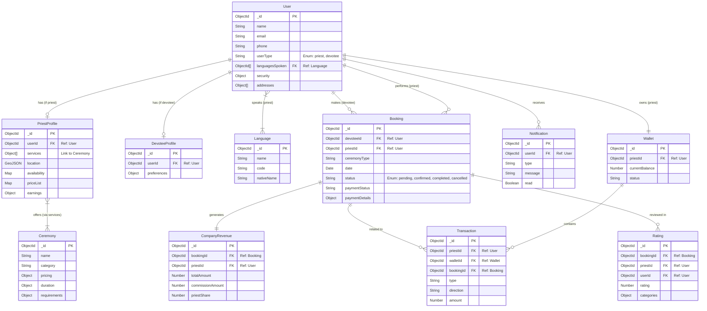

# Complete Project Database Schema

This document provides a comprehensive overview of the database schema, including all collections, fields, data types, relationships (primary/foreign keys), and constraints.

## Database Configuration

- **Database Name**: `bmp`
- **Connection Variable**: `process.env.MONGO_URI`
- **ODM**: Mongoose
- **Connection File**: `server.js`

## Entity-Relationship Diagram (ERD)

---

## 1. Core Identity & Profiles

### **User** (`users`)
Central identity for all users (Priests and Devotees).
| Field | Type | Required | Refs | Notes |
| :--- | :--- | :--- | :--- | :--- |
| `_id` | ObjectId | Yes | PK | Primary Key |
| `name` | String | Yes | - | Trimmed |
| `email` | String | Yes | - | Unique, Lowercase |
| `phone` | String | Yes | - | Unique |
| `userType` | String | Yes | - | Enum: `['priest', 'devotee']` |
| `firebaseUid` | String | No | - | Sparse, Unique (Auth) |
| `languagesSpoken` | ObjectId[] | No | `Language` | Array of Foreign Keys |
| `addresses` | Object[] | No | - | embedded address details |
| `security` | Object | No | - | 2FA, lock status, login attempts |
| `notifications` | Object | No | - | Preferences |

### **PriestProfile** (`priestprofiles`)
Extended profile data for users with `userType: 'priest'`.
| Field | Type | Required | Refs | Notes |
| :--- | :--- | :--- | :--- | :--- |
| `_id` | ObjectId | Yes | PK | Primary Key |
| `userId` | ObjectId | Yes | `User` | Foreign Key, Unique |
| `services` | Object[] | No | `Ceremony` | List of offered services with custom price/duration |
| `location` | GeoJSON | No | - | standard 2dsphere index |
| `availability` | Object | No | - | `weeklySchedule` (Map), `dateOverrides` (Array) |
| `serviceRadiusKm` | Number | No | - | Default: 10 |
| `templesAffiliated`| Object[] | No | - | Name and Address |
| `earnings` | Object | No | - | Cached stats (thisMonth, total, etc.) |
| `verificationDocuments` | Object[] | No | - | KYC docs |

### **DevoteeProfile** (`devoteeprofiles`)
Extended profile data for users with `userType: 'devotee'`.
| Field | Type | Required | Refs | Notes |
| :--- | :--- | :--- | :--- | :--- |
| `_id` | ObjectId | Yes | PK | Primary Key |
| `userId` | ObjectId | Yes | `User` | Foreign Key, Unique |
| `preferences` | Object | No | - | `preferredCeremonies`, `preferredPriests` |
| `address` | Object | No | - | Primary address |

---

## 2. Operations (Bookings & Reviews)

### **Booking** (`bookings`)
Represents an appointment between a Devotee and a Priest.
| Field | Type | Required | Refs | Notes |
| :--- | :--- | :--- | :--- | :--- |
| `_id` | ObjectId | Yes | PK | Primary Key |
| `devoteeId` | ObjectId | Yes | `User` | Foreign Key |
| `priestId` | ObjectId | Yes | `User` | Foreign Key |
| `ceremonyType` | String | Yes | - | Typically matches a `Ceremony` name/id |
| `date` | Date | Yes | - | Booking Date |
| `startTime` | String | Yes | - | HH:mm format |
| `endTime` | String | Yes | - | HH:mm format |
| `status` | String | Yes | - | Enum: `['pending', 'confirmed', 'completed', 'cancelled']` |
| `paymentStatus` | String | No | - | Enum: `['pending', 'completed', 'refunded']` |
| `totalAmount` | Number | Yes | - | Final charged amount |
| `statusHistory` | Object[] | No | `User` | Audit trail of status changes |

### **Rating** (`ratings`)
Feedback provided by a devotee after a booking.
| Field | Type | Required | Refs | Notes |
| :--- | :--- | :--- | :--- | :--- |
| `_id` | ObjectId | Yes | PK | Primary Key |
| `bookingId` | ObjectId | Yes | `Booking` | Foreign Key (Unique with userId) |
| `priestId` | ObjectId | Yes | `User` | Foreign Key |
| `userId` | ObjectId | Yes | `User` | Foreign Key (Reviewer) |
| `rating` | Number | Yes | - | 1-5 Scale |
| `categories` | Object | Yes | - | Breakdown: punctuality, knowledge, behavior, overall |
| `review` | String | No | - | Text comment |

### **Notification** (`notifications`)
System notifications for users.
| Field | Type | Required | Refs | Notes |
| :--- | :--- | :--- | :--- | :--- |
| `_id` | ObjectId | Yes | PK | Primary Key |
| `userId` | ObjectId | Yes | `User` | Foreign Key |
| `type` | String | Yes | - | Enum: `['booking', 'payment', 'reminder', 'general']` |
| `message` | String | Yes | - | Display text |
| `relatedId` | ObjectId | No | Any | Polymorphic reference (Booking/Transaction) |

---

## 3. Finance

### **Wallet** (`wallets`)
Digital wallet for priests to track earnings.
| Field | Type | Required | Refs | Notes |
| :--- | :--- | :--- | :--- | :--- |
| `_id` | ObjectId | Yes | PK | Primary Key |
| `priestId` | ObjectId | Yes | `User` | Foreign Key, Unique |
| `currentBalance` | Number | No | - | Default 0 |
| `status` | String | No | - | Enum: `['active', 'frozen']` |

### **Transaction** (`transactions`)
Ledger of all money movements (credits, debits).
| Field | Type | Required | Refs | Notes |
| :--- | :--- | :--- | :--- | :--- |
| `_id` | ObjectId | Yes | PK | Primary Key |
| `priestId` | ObjectId | Yes | `User` | Foreign Key |
| `walletId` | ObjectId | Yes | `Wallet` | Foreign Key |
| `bookingId` | ObjectId | Conditional| `Booking`| Required if type is `credit_for_booking` |
| `type` | String | Yes | - | Enum: `['credit_for_booking', 'debit_commission', 'payout_withdrawal', ...]` |
| `direction` | String | Yes | - | Enum: `['inflow', 'outflow']` |
| `amount` | Number | Yes | - | Transaction value |

### **CompanyRevenue** (`companyrevenues`)
Tracks platform revenue split per booking.
| Field | Type | Required | Refs | Notes |
| :--- | :--- | :--- | :--- | :--- |
| `_id` | ObjectId | Yes | PK | Primary Key |
| `bookingId` | ObjectId | Yes | `Booking` | Foreign Key |
| `priestId` | ObjectId | Yes | `User` | Foreign Key |
| `totalAmount` | Number | Yes | - | Gross booking value |
| `commissionAmount`| Number | Yes | - | Platform fee |
| `priestShare` | Number | Yes | - | Net to priest |

---

## 4. Catalogs & Static Data

### **Ceremony** (`ceremonies`)
Master catalog of available religious services.
| Field | Type | Required | Refs | Notes |
| :--- | :--- | :--- | :--- | :--- |
| `_id` | ObjectId | Yes | PK | Primary Key |
| `name` | String | Yes | - | Service name |
| `category` | String | Yes | - | Enum: `['wedding', 'puja', ...]` |
| `pricing` | Object | Yes | - | Base price, range, factors |
| `duration` | Object | Yes | - | Typical, min, max minutes |
| `requirements` | Object | No | - | Materials list, participant count |

### **Language** (`languages`)
Master list of supported languages.
| Field | Type | Required | Refs | Notes |
| :--- | :--- | :--- | :--- | :--- |
| `_id` | ObjectId | Yes | PK | Primary Key |
| `name` | String | Yes | - | English name |
| `nativeName`| String | Yes | - | Local script name |
| `code` | String | Yes | - | ISO code (e.g., 'EN') |
| `rank` | Number | Yes | - | Usage rank |
