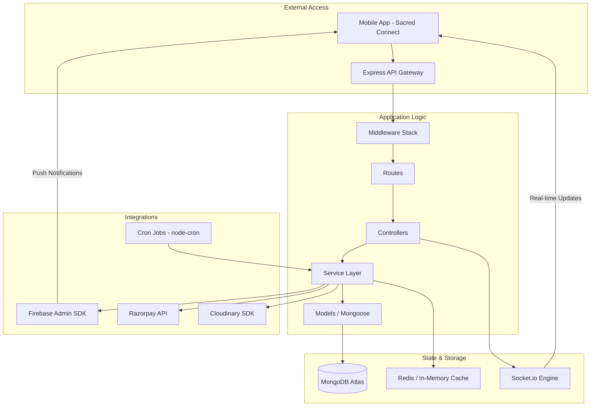

# BookMyPujari (BMP) Server - Backend API

[](https://nodejs.org/)
[](https://expressjs.com/)
[](https://www.mongodb.com/)
[](https://socket.io/)

The BMP Server is a robust, scalable backend infrastructure powering the Sacred Connect mobile application. It manages user authentication, booking workflows, real-time notifications, and financial transactions.

---

## 🏗️ Architecture Overview

The server follows the **MVC (Model-View-Controller)** pattern with an additional **Service Layer** to decouple business logic from API routing. It utilizes a centralized event-driven architecture for real-time features.

### Backend Architecture Diagram



### Core Components
- **Middleware Stack**: Handles Authentication (JWT + Firebase), Rate Limiting, Security Headers (Helmet), and Validation (express-validator).
- **Service Layer**: Contains core business logic (e.g., Booking validation, Payment processing, Priest availability calculations).
- **Socket.io Engine**: Manages persistent connections for instant booking acceptances and chat functionality.
- **Background Jobs**: Scheduled tasks using `node-cron` for automated booking reminders and status cleanup.

---

## 🚀 Tech Stack

- **Runtime**: Node.js
- **Framework**: Express.js
- **Database**: MongoDB with Mongoose ODM
- **Real-time**: Socket.io
- **Auth**: JWT & Firebase Admin SDK
- **Financials**: Razorpay Node SDK
- **Storage**: Cloudinary (via Multer)
- **Notifications**: Expo Server SDK
- **Testing**: Jest & Supertest

---

## 📂 Project Structure

```text
BMPserver/
├── config/             # Database, Firebase, and Cloudinary configurations
├── controllers/        # Request handlers (Parsing & Response formatting)
├── jobs/               # Scheduled tasks (Cron jobs)
├── middleware/         # Auth, validation, and error handling middleware
├── models/             # Mongoose schemas and data models
├── routes/             # API route definitions
├── scripts/            # Database seeding and migration scripts
├── services/           # Core business logic (Complex operations)
├── tests/              # Unit and Integration tests (Jest)
├── utils/              # Helper functions and loggers
└── server.js           # Main entry point and Socket.io initialization
```

---

## 🛠️ Getting Started

### Prerequisites
- Node.js (v18+)
- MongoDB (Local or Atlas)
- Firebase Service Account Key

### Installation
1. Navigate to the server directory:
   ```bash
   cd BMPserver
   ```
2. Install dependencies:
   ```bash
   npm install
   ```
3. Configure environment variables:
   - Copy `.env.example` to `.env`
   - Fill in your `MONGO_URI`, `FIREBASE_ADMIN_SDK`, `RAZORPAY_KEY`, etc.

### Running the Server
**Development Mode:**
```bash
npm run dev
```
**Production Mode:**
```bash
npm start
```

---

## 📡 API Reference (Highlights)

| Category | Endpoint | Method | Description |
| :--- | :--- | :--- | :--- |
| **Auth** | `/api/auth/login` | POST | Authenticates user and returns JWT |
| **Priest** | `/api/priest/profile` | GET | Fetches priest profile and services |
| **Bookings** | `/api/bookings/create` | POST | Initiates a new ceremony booking |
| **Payments** | `/api/wallet/verify` | POST | Verifies Razorpay transaction |
| **Search** | `/api/search/priests` | GET | Search priests by language/location |

For a complete list of endpoints, refer to the [Routes](./routes/) directory.

---

## 📚 Documentation

- [Database Schema](./DB_SCHEMA.md) - Complete database schema documentation
- [Testing Guide](./TESTING.md) - Testing documentation and guidelines
- [Payment Flow](./architecture/payment_flow.md) - Logic for Razorpay integration
- [Troubleshooting](./TROUBLESHOOTING.md) - Common issues and fixes

---

## 🗄️ Database
We use MongoDB for its flexibility with hierarchical data (like priest services).
- [Database Schema Details](./DB_SCHEMA.md)
- [Seeding Instructions](./scripts/)

---

## 🧪 Testing
We use **Jest** for testing API endpoints and business logic.
```bash
npm test
```
Refer to [TESTING.md](./TESTING.md) for detailed testing strategies.

---

## 📄 License
Internal Project - All Rights Reserved.
