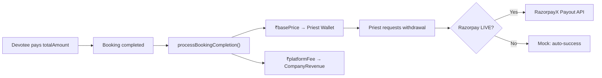

# Aggregator Payment Model Architecture

```mermaid
flowchart LR
    A["Devotee pays totalAmount"] --> B["Booking completed"]
    B --> C["processBookingCompletion()"]
    C --> D["₹basePrice → Priest Wallet"]
    C --> E["₹platformFee → CompanyRevenue"]
    D --> F["Priest requests withdrawal"]
    F --> G{"Razorpay LIVE?"}
    G -- Yes --> H["RazorpayX Payout API"]
    G -- No --> I["Mock: auto-success"]
```
