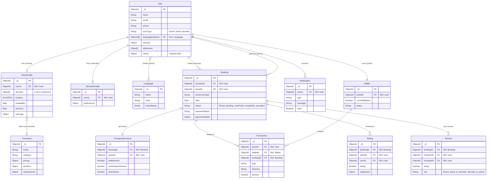
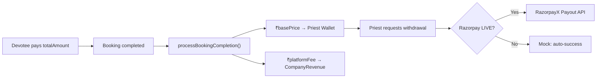

# System Architecture & Database Schema

This document provides a comprehensive overview of the BMPserver architecture, including the database schema and key operational flows.

## 1. Entity-Relationship Diagram (ERD)

---

## 2. Payment Flow Architecture

The platform uses an aggregator payment model where the devotee pays the total amount, and the system handles the split between the priest and the company.

---

## 3. Database Collections

### Core Identity & Profiles

#### **User** (`users`)
Central identity for all users (Priests and Devotees).

| Field | Type | Required | Refs | Notes |
| :--- | :--- | :--- | :--- | :--- |
| `_id` | ObjectId | Yes | PK | Primary Key |
| `name` | String | Yes | - | Trimmed |
| `email` | String | Yes | - | Unique, Lowercase |
| `phone` | String | Yes | - | Unique |
| `userType` | String | Yes | - | Enum: `['priest', 'devotee']` |
| `firebaseUid` | String | No | - | Sparse, Unique (Auth) |
| `languagesSpoken` | ObjectId[] | No | `Language` | Array of Foreign Keys |
| `addresses` | Object[] | No | - | Embedded address details |
| `security` | Object | No | - | 2FA, lock status, login attempts |
| `notifications` | Object | No | - | Preferences |
| `rating` | Object | No | - | Cached stats: `average`, `count`, `breakdown` |

#### **PriestProfile** (`priestprofiles`)
Extended profile data for users with `userType: 'priest'`.

| Field | Type | Required | Refs | Notes |
| :--- | :--- | :--- | :--- | :--- |
| `userId` | ObjectId | Yes | `User` | Foreign Key, Unique |
| `services` | Object[] | No | `Ceremony` | List of offered services |
| `location` | GeoJSON | No | - | 2dsphere index |
| `availability` | Object | No | - | Weekly schedule & overrides |
| `earnings` | Object | No | - | Cached stats |

#### **DevoteeProfile** (`devoteeprofiles`)
Extended profile data for users with `userType: 'devotee'`.

| Field | Type | Required | Refs | Notes |
| :--- | :--- | :--- | :--- | :--- |
| `userId` | ObjectId | Yes | `User` | Foreign Key, Unique |
| `preferences` | Object | No | - | Preferred ceremonies/priests |

### Operations & Catalogs

#### **Booking** (`bookings`)
Represents an appointment between a Devotee and a Priest.

#### **Ceremony** (`ceremonies`)
Master catalog of available religious services.

#### **Language** (`languages`)
Master list of supported languages.

---

## 4. Financial Tracking

The system tracks every rupee through a double-entry ledger system.

- **Wallet**: Stores current available balance for priests.
- **Transaction**: Every credit/debit record.
- **CompanyRevenue**: Platform's cut from every successful booking.
